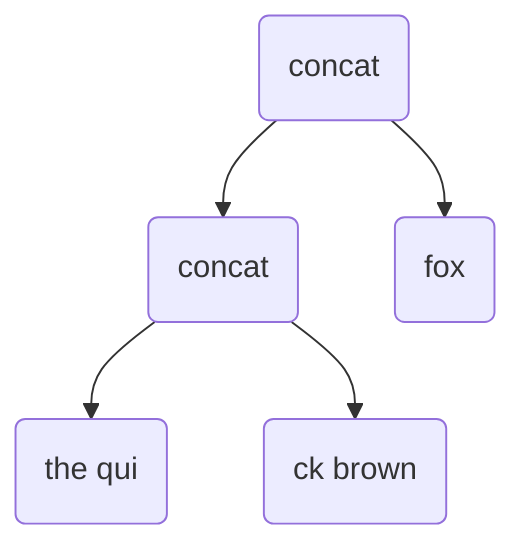
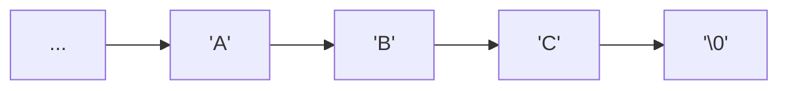

# Ropes Are Better Than Strings

Hans-J. Boehm, Russ Atkinson and Michael Plass
XeroxPARC

## Abstract

Programming languages generally provide a "string" or "text" type to allow manipulation of
sequences of characters. This type is usually of crucial importance, since it is normally mentioned
in most interfaces between system components. We claim that the traditional implementations of
strings, and often the supported functionality, are not well suited to such general-purpose use.
They should be confined to applications with specific, and unusual, performance requirements.
We present "ropes" or "heavyweight" strings as an alternative that, in our experience leads to
systems that are more robust, both in functionality and in performance.

Ropes have been in use in the Cedar environment almost since its inception, but this appears
to be neither well-known, nor discussed in the literature. The algorithms have been gradually
refined. We have also recently built a second similar, but somewhat lighter weight, C-Ianguage
implementation. We describe the algorithms used in both, and give usage examples and
performance comparisons for the C version.

## What's Wrong With Strings?

Programming languages such as C and traditional Pascal provide a built-in notion of strings as
essentially fixed length arrays of characters. The language itself provides the array primitives for
accessing such strings, plus often a collection of library routines for higher level operations such as
string concatenation. Thus the implementation is essentially constrained to represent strings as
contiguous arrays of characters, with or without additional space for a length, expansion room, etc.

There is no question that such data structures are occasionally appropriate, and that an "array
of characters" data structure should be provided. On the other hand, since the character string
type will be used pervasively to communicate between modules of a large system, we desire the
following characteristics:
1. Immutable strings should be well supported. A procedure should be able to operate on a string
it was passed without accidentally modifying the caller's data structures. This becomes
particularly important in the presence of concurrency, where in-place updates to strings would
often have to be properly synchronized.
2. Commonly occurring operations on strings should be efficient. In particular (nondestructive)
concatenation of strings and nondestructive substring operations should be fast, and should not
require excessive amounts of space.
3. Common string operations should scale to long strings. There should be no practical bound on
the length of strings. Performance should remain acceptable for long strings. (Most users of
many standard UNIX(TM) will immediately recognize the motivation behind this requirement.
1
E.g. the vi editor is unusable on many text files due to a line length limit. An unchecked input
limit in fingerd supported the Morris internet wonn [Spafford 89]. A six month old child
randomly typing at a workstation would routinely crash some older UNIX kernels due to a
buffer size limitation, etc.)
4. It should be as easy as possible to treat some other representation of "sequence of character"
(e.g. a file) as a string. Functions on strings should be maximally reusable.
Standard string representations violate most of these. Immutable strings mayor may not be
supported at the language level. Concatenation of two immutable strings involves copying both,
and thus becomes intolerably inefficient, in both time and space, for long strings. The substring
operation usually (though not necessarily) exhibits similar problems. Since strings are stored
contiguously, any copying of strings results in the allocation of large chunks of storage, which may
also result in substantial memory fragmentation. (For long strings, we have observed this to be a
problem even for some compacting garbage collectors, since they are likely to avoid moving very
large objects.)

As mentioned above, it is very common for application programs not to scale to long string
inputs at all. When they do, they commonly use special purpose data structures to represent those
strings in order to obtain acceptable perfonnance. We are not aware of any standard UNIX text
editors that use a general purpose string representation for the file being edited. Doing so would
make character insertion in long files intolerably slow. The approach we propose makes that
practical.

In order to maximize reusability of string functions, it should be easy to coerce other
representations into standard strings. This is always possible by copying the characters and
building the appropriate string representation. But this is undesirable if, for example, the original
sequence is a long file, such that only the first few characters are likely to be examined. We would
like to be able to convert files into strings without first reading them.

## An Alternative

In order to allow concatenation of strings to be efficient in both time and space, it must be
possible for the result to share much of the data structure with its arguments. This implies that
fully manual storage management (e.g. based on explicit malloe/free) is impractical. (It can be
argued that this is true even with conventional string representations. Manual storage management
typically results in much needless string copying.) Though an explicitly reference counted
implementation can be built, we will assume automatic garbage collection.

Since concatenation may not copy its arguments, the natural alternative is to represent such a
string as an ordered tree, with each internal node representing the concatenation of its children,
and the leaves consisting of flat strings, usually represented as contiguous arrays of characters.
Thus the string represented by a tree is the concatenation of its leaves in left-to-right order:


Figure 1. Rope representation of "The quick brown fox"

We refer to character strings rep resented as a tree of concatenation nodes as ropes. (This is a
little sloppy. A rope may contain shared subtrees, and is thus really a directed acyclic graph, where
the out-edges of each vertex are ordered. We will continue to be sloppy.)

Ropes can be viewed as search trees that are indexed by position. If each vertex contains the
length of the string represented by the subtree, then minimal modifications of the search tree
algorithms yield the following operations on ropes:

Fetch ith character: A simple search tree lookup. Rather than examining the subtree containing
the right key, we examine the tree containing the proper position, as determined by the length
fields.
Concatenate two ropes: Search tree concatenation as defined in [Knuth 73].
Substring: Two search tree split operations, as defined in [Knuth 73].
Iterate over each character: Left-to-right tree traversal.

The first three of the above operations can be performed in time logarithmic in the length of
the argument using, for example, B-trees or A VL trees [Knuth 73, Bent et al 82]. Note that since
strings are immutable, any nodes that would be modified in the standard version of the algorithm,
as well as their ancestors, are copied. Only logarithmically many nodes need be copied.

The last can be performed in linear time for essentially any search tree variant. Thus both
concatenation and substring operations (other than for very short substrings) are asymptotically
faster than for conventional flat strings. The last exhibits roughly the same performance. The first
is somewhat slower, but usually infrequent.

In practice, we modify this in two ways. Concatenation is often a sufficiently important
operation that it should run in unit, not logarithmic, time. Long output strings are typically built
by concatenating short ones. For example, compilers generating assembly language output may do
so by concatenating strings in memory [BoehmZwaenepoel 87]. Hence binary concatenation
3
normally simply adds a root node, and does not rebalance the tree. The rebalancing operation is
either performed selectively, or invoked explicitly. Effectively this trades speed of the substring
and fetch operations for better concatenation performance. Iteration over a rope is basically
unaffected.

(Theoretically it is possible to guarantee that the first three operations run in amortized
logarithmic time, the iteration operation runs in linear time, and individual concatenations are
performed in constant time by using a "splay tree" based representation [Tarjan 83, SleatorTarjan
83], in which each node represents the concatenation of a (possibly empty) rope, a (nonempty) flat
string, and another rope. This appears impractical in our situation, since the fetch operation
requires large amounts of allocation and data structure modification. Furthermore, in a
multithreaded environment, the fetch operation appears to require locking.)

It is useful to introduce additional kinds of tree nodes. At a minimum, we allow a second kind
ofleaf node containing at least a length and a user-defined function for computing the ith character
in the string. This allows other representations of character sequences (e.g. files) to be treated as
ropes without copying. It may further be useful to introduce substring nodes, so that long
su bstrings of flat ropes do not require copying.

## Algorithms

We briefly discuss the implementation of the more common operations. We will largely
ignore nodes containing user defined functions, in that they do not affect the algorithms
significantly. We assume that all leaves are nonempty. We exclude empty ropes from
consideration: they are a trivial special case.

Note that all operations are completely nondestructive. They may be performed without
locking in a multithreaded environment.

## Concatenation

In the general case, concatenation involves simply allocating a concatenation node containing
two pointers to the two arguments. For performance reasons, it is desirable to deal with the
common case in which the right argument is a short flat string specially. If both arguments are
short leaves, we produce a flat rope (leaf) consisting of the concatenation. This greatly reduces
space consumption and traversal times. If the left argument is a concatenation node whose right
son is a short leaf, and the right argument is also a short leaf, then we concatenate the two leaves,
and then concatenate the result to the left son of the left argument. Together, these two special
cases guarantee that if a rope is built by repeatedly concatenating individual characters to its end,
we still obtain a rope with leaves of reasonable size. They also greatly reduce the imbalance of the
resulting trees.

Since the length of ropes is, in practice, bounded by the word size of the machine, we can
place a bound on the depth of balanced ropes. The concatenation operation checks whether the
resulting tree significantly exceeds this bound. If so, the rope is explicitly rebalanced (see below).
This has several benefits:
1. The balancing operation is only invoked implicitly for long ropes, and then rarely. Each
balancing operation will normally reduce the depth of the rope to considerably below the
4
threshold.
2. Recursive operations on ropes require a bounded amount of stack space.
3. Paths in the tree can be represented in a fixed amount of space. This is important for the C
implementation (see below).

## Substring

The substring operation on structured ropes can be easily implemented. We assume the
substring operation on leaves simply copies the relevant section of the leaf, and deals with negative
start arguments and over-length arguments correctly.
```haskell
substr( concat(ropel, rope2), start, len) =
    let
        left = if start <= 0 and len >= length(ropel) then
                    ropel
                else
                    substr(ropel, start, len)
        right = if start <= length(ropel)
                and start + len >= length(ropel) + length(rope2) then
                    rope2
                else
                    substr(rope2, start - length(ropel), len - length(left))
    in
        concat(left, right)
```

This involves one recursive call for each tree node along along the left or right boundary of
the substring. Hence its running time is bounded asymptotically by the tree height.

There is a tradeoff between this kind of eager substring computation, and one in which
substrings are computed lazily by introducing a special substring nodes, representing an
unevaluated substring. In practice we want to use lazy substring computations at least when we
compute long substrings of very long flat ropes (e.g. a function node representing a lazily-read file).

## Rebalancing

Rebalancing produces a balanced version of the argument rope. The original is unaffected.
We define the depth of leaf to be $0$, and the depth of a concatenation to be one plus the
maximum depth of its children. Let $F_n$ be the nth Fibonacci number. A rope of depth $n$ is
balanced if its length is at least $F_n+ 2$ , e.g. a balanced rope of depth $1$ must have length at least $2$.
Note that balanced ropes may contain unbalanced subropes.

The rebalancing operations maintains an ordered sequence of (empty or) balanced ropes, one
for each length interval $[Fn, Fn+1)$, for $n >= 2$. We traverse the rope from left to right, inserting
each leaf into the appropriate sequence position, depending on its length. The concatenation of
the sequence of ropes in order of decreasing length is equivalent to the prefix of the rope we have
traversed so far. Each new balanced rope (or leaf) $x$ is inserted into the appropriate entry of the
sequence. 

Assume that $x$'s length is in the interval $[F n, F n+ 1)$, and thus it should be put in slot $n$
(which also corresponds to maximum depth $n - 2$). If all lower and equal numbered levels are
$5$
empty, then this can be done directly. If not, then we concatenate ropes in slots $2 .. (n - 1)$
(concatenating onto the left), and concatenate $x$ to the right of the result. We then continue to
concatenate ropes from the sequence in increasing order to the left of this result, until the result fits
into an empty slot in the sequence.

The concatenation we form in this manner is guaranteed to be balanced. The concatenations
formed before the addition of $x$ each have depth at most one more than is warranted by their
length. If slot $n - 1$ is empty then the concatenation of shorter ropes has depth at most $n - 3$, so the
concatenation with $x$ has depth $n - 2$, and is thus balanced. If slot $n - 1$ is full, then the final depth
after adding $x$ may be $n - 1$, but the resulting length is guaranteed to be at least $F_n+ 1$, again
guaranteeing balance. Subsequent concatenations (if any) involve concatenating two balanced
ropes with lengths at least $F_m$ and $F_{m-l}$ and producing a rope of depth $m - 1$, which must again be
balanced.

The same argument almost applies when we add a balanced tree $b$ instead of a leaf to the
sequence. We may introduce one additional tree level immediately above the insertion point for
$b$, adding one to the depth of the final tree. In practice we insert already balanced trees as a unit,
and thus avoid rebuilding the entire tree in response to a rebalancing operation.

The final step in balancing a rope is to concatenate the sequence of ropes in order of
increasing size. The resulting rope will not be balanced in the above sense, but its depth will
exceed the desired value by at most $2$. One additional root node may be introduced by the final
concatenation. (Indeed, this is necessary. Consider concatenating a small leaf to a large balanced
tree to another small leaf. We must add $2$ to the depth of the resulting tree unless we reexamine
the balanced tree. Note that only trees that are balanced by our original strict definition are not
reexamined. )

There are many possible variations to this approach. Our balance condition was expressed in
terms of length, and our algorithm tends to move long flat ropes close to the root. One could also
rebalance purely in terms of node count.

## C Cords

We implemented a version of the above as a C library. Since this implementation is lighterweight than Cedar ropes, and heavier than C strings, we dubbed the resulting objects "cords".

The C implementation operates under certain constraints. The compiler dictates that a string
constant is represented as a pointer to a `NUL`-terminated contiguous array of characters. For our
package to be practical, C string constants must double as cord constants. Hence cords are also
declared to be character pointers (,`const char *` to be exact), as are C strings, but are actually
represented as either a `NIL` pointer, denoting the empty cord, or in one of the following three
ways:


----------------------
Variation 2:

| 0 |    1   | 2 | 3 |
| - |    -   | - | - |
| 0 | fn tag | 0 | 0 |
|      Length        |
|  function pointer  |
|    client data     |
----------------------

----------------------
Variation 3:

| 0 | 1          |   2   |     3    |
| - | ---------- | ----- | -------- |
| 0 | concat tag | depth | left-len |
|               Length              |
|             left child            |
|             right child           |
----------------------

Figure 2. Cord representation variants

The first is a pointer to a *nonempty* C string, the second is essentially a pointer to a function
closure for computing the ith character in the cord, and the third a pointer to a concatenation node.
Concatenation nodes contain a one byte depth field, which is guaranteed to be sufficient, given the
word length and balancing constraint. A one byte "length of left child" field is included, and
eliminates essentially all calls to compute the length of C strings during cord traversals. A zero
value in this field indicates a long left child.

Cords are balanced exactly as described above. The substring operation may operate lazily and
introduce a special variant of a closure node whose environment contains a pointer to a (flat) cord,
and a starting position within that cord. Substring operations on long flat cords do not copy
characters. This special variant is recognized by the substring operation, so that nested substring
operations do not result in nested substring nodes.

This design has several benefits:
1. String constants may (or other nonempty C strings) may be passed directly to procedures
expecting cords.
2. Unlike C strings, `NUL` characters may be embedded inside cords (using the closure variant).
3. Concatenation and closure nodes are small.
4. The length of non-flat cords may be cheaply computed. Lengths of C strings at leaves may often
be cheaply computed from the context in which they appear. (For example, the substring
operation can usually do so.)

We use the concatenation optimizations described above. Ropes are balanced either in
response to an explicit call, or when the depth of a rope exceeds a threshold larger than the depth
of any balanced rope.

Since C does not provide function closures directly, it is clumsy to write client code that
invokes an iterator function to traverse a string, tempting programmers to use the (significantly
slower) fetch operation instead. (The recursive version of this operation is even slower than one
might think on register window machines.) We sidestep this issue by introducing a *cord position*
abstraction. Abstractly, this is a pair consisting of a cord, and a character index in the cord.
Concretely, a cord position is represented by these, plus the path from the root of the cord to the
leaf containing the index, and some cached information about the current leaf. Cord positions
provide fast operations for retrieving the current character, and advancing the position to the next
(or previous) character.

The implementation uses a recent version of the conservative garbage collector described in
[Boehm Weiser 88, Boehm 93], as does the current Cedar implementation. It is available, together with the garbage collector, and a toy text editor built on cords from [github](https://github.com/ivmai/bdwgc/tree/master/cord). This editor maintains a complete edit history as simply a stack of cords, each cord representing the entire file contents. Performance is usually more than
adequate, even on multi-megabyte files. Memory use is moderate, both since history entry share
nearly all of their space, and because large files can be read lazily, and not kept in memory. This
implementation is however not nearly as mature as the Cedar implementation.

## Cedar Ropes

Cedar ropes are explicitly supported by the language. The representation of normal flat ropes
(leaves) coincides with that of a built-in flat string type "text". String constants have type "rope"
or "text", depending on context.

Concatenation is implemented with the optimizations described above. Balancing is also
similar to what is described above.

In addition to the representation variants used for cords, a Cedar rope may be represented by
a replacement node, denoting a lazy replacement of a substring of a rope by another rope. It is
unclear that this variant is necessary, since it could also be represented by a concatenation with
substrings.

Instead of leaves containing user-defined functions, Cedar ropes may be represented by
"object" nodes that contain "member" functions to perform several different operations, including
fetching a specific character. (All of the operations other than "fetch" have defaults provided.)
This makes such nodes a bit more expensive to manipulate, but makes certain operations (e.g.
traversal and copying characters to a flat buffer) considerably cheaper.

Cedar substring nodes are completely separate from function nodes, and must be treated
distinctly. As a result, they can be, and are, more heavily used. The substring operation descends
into the tree until it finds the smallest rope $r$ that entirely contains the desired substring. It then
returns a substring node that refers to $r$.

Rope traversal is accomplished primarily with a mapping function that applies a user defined
function to each character. Since Cedar allows nested functions to be passed as arguments, this
provides a much cleaner interface than in C.

The vast majority of interfaces that deal with sequences of characters traffic in ropes. Rope
nodes are the single most commonly occurring object in most Cedar heaps, both in terms of their
number and their total size.

Much of the Cedar environment is available as [Hauser 93].

## Performance

The Cedar system makes heavy use of ropes throughout. The text editor represents
unstructured text files as a single rope. The performance of the system is quite competitive.

Similarly, the above-mentioned toy editor performs quite well, even on very large files. In
order to give some more quantitative comparisons of the techniques we advocate with conventional
string programming techniques, we measured operations likely to be common in either case.

Figure 3 reports the cost of string concatenations in CPU microseconds on a Sun
SP AR CStation 2 running SunOS4.1.3. We measured the cost of concatenating two strings or ropes
of various lengths. Since storage allocation cost signifcantly affects the overall cost, we measured
C-style string concatenation with several different allocation strategies:

- C-CONCAT IGC: Nondestructively concatenate a string to itself, using two strlen calls, an
allocation, and two memcpy calls. This uses version 4.1 of our conservative garbage collector in
its default (more space- than time-efficient) configuration. (The contiguous strings of length
200,000 were allocated with interior pointer recognition disabled to avoid anomalous behavior.
See [Boehm 93] for a discussion of why this is desirable.) All programs were compiled with gcc
and statically linked. Garbage collection times are included. The tests were run for enough
iterations in the same heap to force several collections.
- C-CONCAT/BIG HEAP: As above, but the heap was expanded by 4 MB at start-up. This
significantly reduces garbage collection overhead.
- C-CONCAT/SUN MALLOC: As above, but uses the SunOS 4.1.3 default malIoc. Note that this
actually performs slightly worse than even C-CONCAT IGC for short strings, but outperforms
the garbage collected versions for long strings (which force more frequent collection).
- CORD CONCAT: Concatenate a cord to itself. Uses the garbage collector in default
configuration. The cord was built as in BUFFERED-CORD below. This matters only in that
the cord is structured, and hence has an easily available length, except in the length 10 and 100
cases. The time per operation is basically constant, except that short strings require calls to
strlen, and that long strings force a large heap, which tends to reduce GC overhead. CORD CONCAT IBIG: Same as CORD CONCAT, except that the heap was expanded by 4 MB at start-up.

(Chart in the PDF)

- Y-Axis: SS2 cpu us per string - log 10 -> 1E5
- X-Axis: Length - log 10 -> 1E5
- XY 45 deg slope: CConcat/GC, CConcat/BigHeap,Concat/SunMalloc
- Flat @ Y=10 us/string: Cord/Concat, Cord/ConcatBig

Figure 3. Concatenation time

We also measured the time it took to build C cords and conventional C strings a character at a
time, using various common (though not necessarily good) programming techniques. These
correspond roughly to the techniques that might be used when reading in a text file or a command
line, and building an in-core version of the string.

All measurements are again given in user mode cpu microseconds on a SPARCstation 2.
Times are per constructed string, for string lengths of 10 to 100,000 characters. Though the
measurements are quite repeatable, they should be taken as rough values, since they depend on
many parameters not discussed here. (E.g., the pointers to the strings were kept in staticallyallocated global variables.)

This time all measurements were performed using our collecting allocator. Our version of C's
realloc explicitly deallocates storage; no other storage was explicitly deallocated.

Measurements for the following operations are given in figure 4. Note that most are not
strictly comparable, in that they do not all perform comparable functions. The point is to
demonstrate that even for operations like in-place construction of strings, not much, if anything is
lost by using cords.

(PDF Chart)

Figure 4. Build time

- UNBUFFERED: Build up a C string by initially allocating a single byte, and then repeatedly
reallocating the buffer and adding the new character to the end with the C strcat function. Note
that this copies the string only when realloc copies. (The realloc implementation copies at
geometrically increasing lengths for small strings, and whenever the new object requires an
additional page for large strings.) Every character involves a traversal of the first string. (This is
a highly suboptimal algorithm, which unfortunately appears to be used occasionally.)
- BUFFERED: Build up a C string by initially allocating a single byte, putting new characters in a
buffer, and destructively appending the buffer to the strings when it is full. Append is
implemented using C's realloc and strcat. The buffer size is 128 bytes.
- CAT -BUILD: We build a cord. A cord consisting of a single character is repeatedly concatenated
to the cord. (This is usually an amateur programming technique, roughly comparable to
- UNBUFFERED. It does have the advantage that nothing is being destructively updated. Any
prefix can be safely saved with a pointer copy.)
- BUFFERED CORD: Similar to BUFFERED, but each time the buffer fills, it is concatenated to the cord. This uses routines provided by the cord implementation for this purpose. The buffer
size is again. 128. The resulting cord is explicitly balanced. The interface is similar to Modula-3
"'text writers" [Nelson 91]. The implementation is tuned for short strings.
- GEOMETRIC: The space allocated to the string is grown by factors of2, starting at 1. Strcat is not
used, string length is not recomputed.
- SIMPLE: Build up a C string by preallocating a sufficiently large buffer and filling it in. (A
commonly used technique. Fails for unexpectedly long strings.)

Finally figure 5 gives the time required to completely traverse a C style string or cord of a
given length. Times are again given ber string traversal. We exclusive-or all the characters in the
string to ensure that the character retrieval cannot be optimized away by the compiler. We
measured the following kinds of traversals.

(B.F. Cord Trav gets 2nd best after C-Traverse)

Figure 5. Traversal time

- CORD TRAV: Traverse a cord built by CONCAT, using the cord position primitives described
above. With the help of some macors provided by the cord package, the traversal code looks
very similar to what is needed for traversing a traditional C string.
- B. CORD TRAV: Same as CORD TRAV, but uses the cord from BUFFERED-CORD. Cord is
more balanced with larger leaves.
- F. CORD TRAV: Same as CORD TRAV, but does not use the cord position primitives. Instead it
explicitly invokes an iterator function. The iterator function is passed a function that examines
an individual character. It can also be optionally passed a second function that will accept longer
substrings (as C strings) and process more than one character at a time. In this case such a
function was also provided. This takes about 15 more lines of code than CORD TRAV. (This
code would have to be repeated for each type of string traversal.)
- B. F. CORD TRAV: Same as F. CORD TRAV, but uses the cord from BUFFERED-CORD. This
represents the best case for a cord traversal.
- C-TRAVERSE: Traverse a C string using explicit inline array subscripting. The C string pointer
was stored in a global, but the resulting load was optimized out by the compiler.

## Previous Work

Many imperative programming languages have recognized the desirability of an immutable
string type. The earliest languages with immutable strings that we could find were Basic, XPL and
Snobol [Griswold et al 71]. SAIL [VanLehn 73] included flat immutable strings, together with
provisions for fast concatenation in special cases. The builtin string type in CLU is immutable
[Liskov et al 81]. Though CLU also used a flat representation, it inspired Cedar ropes. Standard
ML has immutable strings, and Scheme implementations are allowed to omit the string mutation
operations. But all implementations of which we are aware use flat representations.

Linked string representations are considered in [Madnick 67]. However, he considers only
linearly linked representations designed for fast in-place updates. Nondestructive concatenation
and substring operations perform poorly on these representations.

Several authors have discussed general techniques for efficient implementations of immutable
data structures. Most of these rely on the use of balanced "tree" structures, and copying of
modified nodes, as we do. Probably the closest to our work is [Myers 84], which discusses
nondestructive operations on linear lists using A VL DAGs. The string case is not specifically
discussed (though he also uses an editor application). Our data structure is quite different from his
to accommodate fast concatenation, the small list elements (characters), lazily evaluated sublists,
and the need for proper integration with string constants.

A more sophisticated implementation technique for immutable data structures is described in
[Driscoll et aI86]. Their approach could be used, for example, to implement ropes with 0(1) space
cost for character insertion and deletion, even when the original rope is retained. However their
approach again appears to require locking.

The idea of representing a string as a tree of concatenations has been rediscovered multiple
times, particularly in the context of attribute grammars (cf. [BoehmZwaenepoel 87] or Rodney
Farrow's Linguist system). Here a fast concatenation operation is often sufficient. We do not
know of other published generalizations to a comprehensive collection of string operations.

Cedar Ropes themselves have evolved since 1982. They are mentioned in passing, but not
described, in [Lampson 83] and [Swinehart et al 85]. [Swinehart et al 86] and [Teitelman 84] each
contain a one paragraph description of ropes, with no implementation details (some of which have
changed since then). [Swinehart et al 86] also discusses some applications of ropes.
Variations of ropes have also appeared in DEC SRC programming environments.
Modula-2 + provided both an interface and implementation similar to Cedar ropes. Modula 3
[Nelson 91] provides the interfaces, but the current implementation uses a flat representation.
(Though we haven't done a thorough study, this choice appears to at least double the heap space
requirements of one of the Modula-3 programs we did examine.)

## Conclusions

We have argued that it is important to provide an immutable character string type that
provides a cheap concatenation operation. and scales correctly to long strings. so that modules with
string inputs can be truly reusable. It is important that programming languages either provide this
facility or can be easily extended to provide it. The Cedar language supports it explicitly. It is
possible to add it to C as a library. with some small further loss of type safety. This is much more
than compensated for by the elimination of subscript errors resulting from needless low-level string
manipulation.

It is not clear whether the implementation we suggested above is in any sense optimal.
However, it performs sufficiently well for our purposes, and sufficiently well that for most
purposes it is preferred over traditional "flat" string representations. Our experience has been that
it results in software that is noticeably more robust. particularly in that it scales correctly to
unexpectedly large inputs.

## Acknowledgements

Many other members of PARC CSL have contributed to the Cedar Rope package. Dan
Swinehart helped us track down the history of immutable strings.

## References

[Bent et al 82] Bent, Samuel W .. Daniel D. Sleator. and Robert E. Tarjan. "Biased 2-3 Trees".
Proceedings of the 21st Annual Symposium on Foundations of Computer Science. IEEE. 1980. pp.
248-254.

[Boehm 93] Boehm. Hans-1., "Space Efficient Conservative Garbage Collection", Proceedings of
the ACM SIGPLAN '93 Conference on Programming Language Design and Implementation,
SIGPLAN Notices 28.6 (June 1993). pp.197-206.

[BoehmWeiser 88] Boehm, Hans-J. and Mark Weiser, "Garbage collection in an uncooperative
environment". Software Practice & Experience 18. 9 (Sept. 1988), pp.807-820.

[BoehmZwaenepoel 87] Boehm. H., and W. Zwaenepoel. "Parallel Attribute Grammar
Evaluation", Proceedings of the 7th International Conference on Distributed Computing Systems,
September 1987. pp. 347-355.

[Driscoll et al 86] Driscoll, D., N. Samak. D. Sleator. R. Tarjan, "Making Data Structures
Peristent". JCSS 38.1 (February 1989). pp. 86-124.

[Griswold et al 71] Griswold. R.E. 1. F. Poage, and 1. P. Polonsky, The Snobol4 Programming
Language. Second Edition. Prentice-Hall, 1971.

[Hauser et al 93] Hauser. C., C. Jacobi, M. Theimer, B. Welch, and M. Weiser, "Using Threads in
Interactive Systems: A Case Study", Xerox PARC Technical Report CSL-93-16 CD. This is a
CD-ROM containing both a paper and a Cedar system that can be run under SunOS. Source
code is included for much of the system. including the Rope package.

[Knuth 73] Knuth, D., The Art of Computer Programming, Vol. 3, Searching and Sorting,
Addison-Wesley, 1973.

[Lampson 83] Lampson, Butler W., "A Description of the Cedar Programming Language: A
Cedar Language Reference Manual", Xerox PARC Report CSL 83-15, December 1983 (out of
print).

[Liskov et al 81] Liskov, B., R. Atkinson, T. Bloom, E. Moss, lC. Schaffert, R. Scheiffier, and A.
Snyder, CLU Reference Manual, Springer 1981.

[Myers 84] Eugene W. Myers, "Efficient Applicative Data Types", Conference Record of the
Eleventh Annual ACM Symposium on Principles of Programming Languages, pp. 66-75.

[Nelson 91] Greg Nelson, ed., Systems Programming in Modula-3, Prentice Hall, 1991.

[SleatorTaIjan 83] Sleator, D., and R. TaIjan, "Self-adjusting binary trees", Proceedings, Fifteenth
Annual ACM Symposium on Theory of Computing, 1983, pp. 235-245.

[Spafford 89] Spafford, Eugene H., "Crisis and Aftermath", Communications of the ACM 32, 6
(June 1989), Special Section on the Internet Worm, pp. 678-687.

[Swinehart et al 85] Swinehart, D., P. Zellweger, and R. Hagmann, "The Structure of Cedar",
Proceedings of the ACM SIGPLAN '85 Symposium on Language Issues in Programming
Environments, SIGPLAN Notices 20, 7 (July 1985), pp. 230-244.

[Swinehart et al 86] Swinehart, D., P. Zellweger, R. Beach, and R. Hagmann, '"A Structural View
of the Cedar Programming Environment", Xerox PARC Report CSL 86-1, June 1986.

[TaIjan 83] TaIjan, Robert R., Data Structures and Network Algorithms, SlAM,1983.

[Teitelman 84] Teitelman, W. "A Tour Through Cedar", IEEE Software, April 1984.

[VanLehn 73] VanLehn, Kurt A., ed., SAIL User Manual, Stanford Computer Science
Department Report ST AN-CS-73-373.
